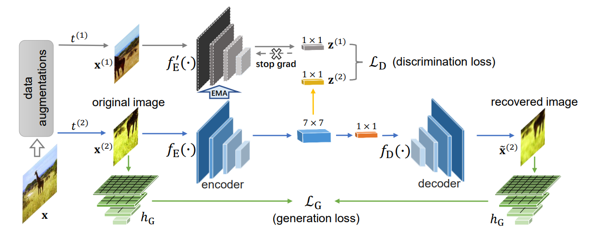

# SaGe
**Semantic-Aware Generation for Self-Supervised Visual Representation Learning ([SaGe](https://arxiv.org/pdf/2111.13163.pdf))**

The code builds upon [OpenSelfSup](https://github.com/open-mmlab/OpenSelfSup).

  

Figure 1: Pipeline of SAGE.

Detailed introduction of SaGe will come soon!
